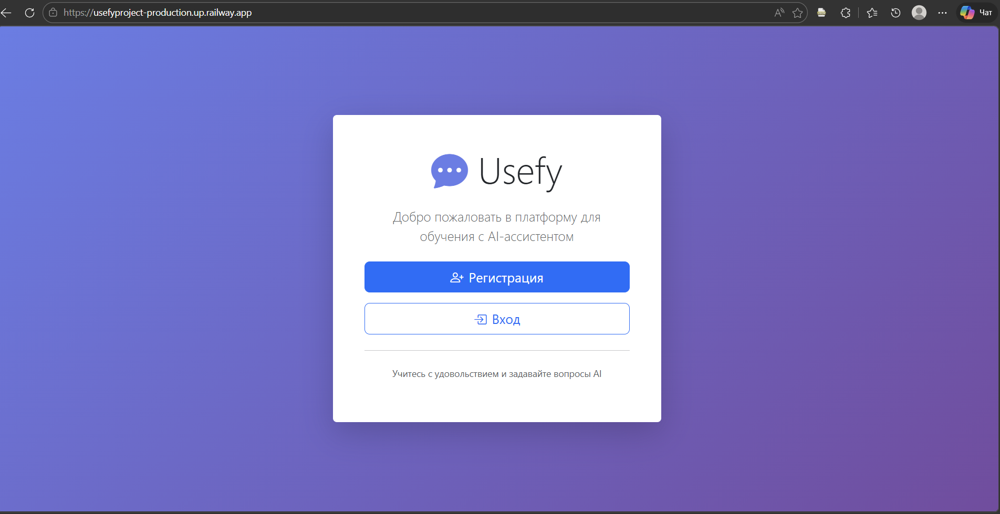
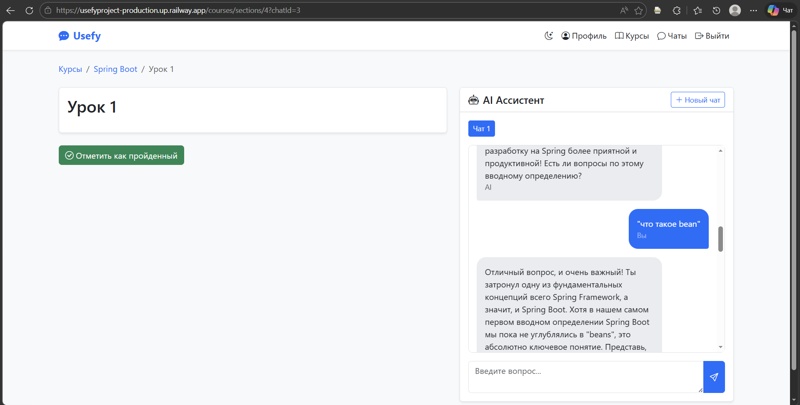
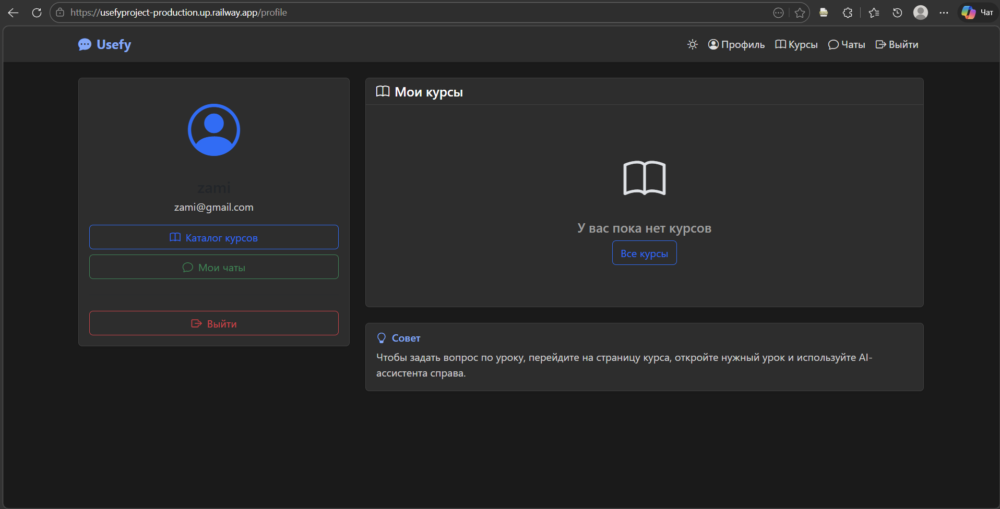
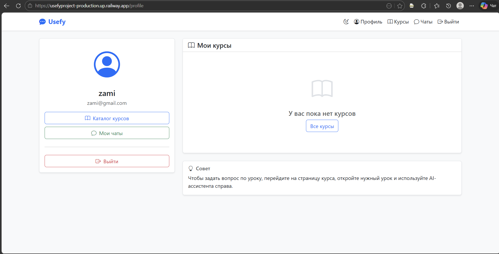

[](https://github.com/zamiramanasova/UsefyProject/actions/workflows/ci.yml)

# Usefy — Образовательная платформа с AI-ассистентом

**Usefy** — это веб-приложение для изучения программирования с интегрированным AI-ассистентом.
Пользователи могут проходить курсы, изучать уроки и задавать вопросы AI, который отвечает на основе материала урока.

🔗 **Живой проект:** [usefyproject-production.up.railway.app](https://usefyproject-production.up.railway.app)

---

## ✨ Функциональность
*   **Регистрация и аутентификация** пользователей (Spring Security)
*   **Управление курсами и уроками** — просмотр, запись на курсы
*   **AI-ассистент на базе Google Gemini** — отвечает на вопросы по материалу урока
*   **История диалога** — AI помнит контекст разговора
*   **Несколько чатов** на один урок
*   **Тёмная тема** 🌙 — переключается одним кликом
*   **Адаптивный дизайн** на Bootstrap
*   **Полное логирование** всех действий

---

## 🛠 Стек технологий
*   **Backend:** Java 17, Spring Boot 3, Spring Security, Spring Data JPA
*   **База данных:** PostgreSQL (продакшен), H2 (тесты)
*   **AI:** Google Gemini API (через OpenAI-совместимый SDK)
*   **Фронтенд:** Thymeleaf, Bootstrap, JavaScript, Markdown
*   **Инструменты:** Maven, Lombok, Git
*   **Тестирование:** JUnit 5, Mockito
*   **CI/CD:** GitHub Actions
*   **Деплой:** Railway

### Built With


---

## 📸 Скриншоты

| Главная страница | Урок с AI-чатом |
|------------------|------------------|
|  |  |

| Тёмная тема | Профиль пользователя |
|-------------|---------------------|
|  |  |

---

## 🚀 Запуск проекта локально

### Требования
- JDK 17+
- PostgreSQL 14+
- Maven
- Git

### Шаги

1. **Клонируй репозиторий**
   ```bash
   git clone https://github.com/zamiramanasova/UsefyProject.git
   cd UsefyProject

Создай базу данных PostgreSQL

CREATE DATABASE usefy;

Настрой переменные окружения
Создай файл .env в корне проекта:

DB_URL=jdbc:postgresql://localhost:5432/usefy
DB_USERNAME=postgres
DB_PASSWORD=твой_пароль
GEMINI_API_KEY=твой_ключ_gemini

Собери и запусти приложение

mvn clean install
mvn spring-boot:run

Открой в браузере
Перейди по адресу: http://localhost:8080

🔑 Где взять API ключ Gemini
Перейди на makersuite.google.com/app/apikey

Войди в Google аккаунт

Нажми "Create API Key"

Скопируй ключ и добавь в .env

## 🧪 Тестирование

Проект покрыт unit-тестами и интеграционными тестами.

### Запуск тестов
```bash
# Запустить все тесты
mvn clean test

# Запустить тесты с отчетом
mvn clean test site


CI/CD
GitHub Actions автоматически запускает тесты при каждом пуше в main/master.
Статус последнего запуска:
https://github.com/zamiramanasova/UsefyProject/actions/workflows/ci.yml/badge.svg

Покрытие тестами
✅ Сервисы (ChatService, UserService, CourseService)

✅ Контроллеры (REST и Web)

✅ Репозитории (DataJpaTest)

✅ Интеграционные тесты

## 🌍 Демо

Проект доступен в интернете по ссылке:  
👉 **[usefyproject-production.up.railway.app](https://usefyproject-production.up.railway.app)**

### Что можно попробовать:
1. **Зарегистрируйся** (или войди с тестовыми данными)
2. **Выбери курс** "Java Basics" или "Spring Boot"
3. **Открой любой урок**
4. **Задай вопрос AI-ассистенту** — он ответит на основе материала урока
5. **Переключи тёмную тему** 🌙 в правом верхнем углу

---

## 📄 Лицензия

Этот проект распространяется под лицензией MIT.  
Подробнее: [LICENSE](LICENSE)

---

## 👩‍💻 Автор

**Замира Келдибаева**  
- GitHub: [@zamiramanasova](https://github.com/zamiramanasova)
- LinkedIn: *[добавь ссылку, если есть]*

---

## ⭐ Поддержка

Если проект понравился — поставь звездочку на GitHub!  
Это помогает другим разработчикам найти его.

---

**Спасибо, что заинтересовались проектом! Удачи в изучении программирования!** 🚀

## 🏗 Архитектура проекта

Проект следует классической трёхслойной архитектуре:

┌─────────────────┐ ┌─────────────────┐ ┌─────────────────┐
│ Controller │────▶│ Service │────▶│ Repository │
│ (Web & REST) │ │ (Business Logic│ │ (Data Access) │
└─────────────────┘ └─────────────────┘ └─────────────────┘
│ │ │
▼ ▼ ▼
┌─────────────────┐ ┌─────────────────┐ ┌─────────────────┐
│ Thymeleaf │ │ AI Service │ │ PostgreSQL │
│ Templates │ │ (Gemini API) │ │ Database │
└─────────────────┘ └─────────────────┘ └─────────────────┘

### Слои приложения:
1. **Controller** — обработка HTTP-запросов, работа с Thymeleaf и REST API
2. **Service** — бизнес-логика, включая интеграцию с AI
3. **Repository** — доступ к данным через Spring Data JPA
4. **Model** — JPA-сущности (User, Course, Section, Chat)


### Build With
<br>
<p>
<a href="https://img.shields.io">
    
  </a>
</p>
<p>
<a href="https://img.shields.io">
    
  </a>
</p>
<p>
  <a href="https://img.shields.io">
    
  </a>
</p>
<p>
  <a href="https://img.shields.io">
    
  </a>
</p>
<p>
  <a href="https://img.shields.io">
    
  </a>
</p>
<p>
<a href="https://img.shields.io">
    
  </a>
</p>
<p>
<a href="https://img.shields.io">
    
  </a>
</p>

